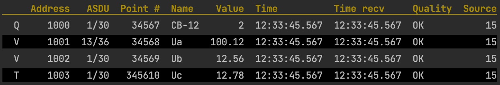

# DynTable
I was trying to use the [awesome go table](https://github.com/tomlazar/table) for my purpose, but in my case, I need to add rows to the table while my application is running. 

Since the table constructor now has no information about the data length of each table cell, I added a column width parameter.
Also, each column of the table has an alignment option - Left or Right.
# Usage

```Go

import table "github.com/PVKonovalov/dyn_table"

func main() {
	tab := table.DynTable{
		Width:   []int{1, 7, 5, 7, 5, 6, 12, 12, 7, 6},
		Headers: []string{" ", "Address", "ASDU", "Point #", "Name", "Value", "Time", "Time recv", "Quality", "Source"},
		Align: []int{table.AlignLeft, table.AlignRight, table.AlignRight, table.AlignRight, table.AlignLeft,
			table.AlignRight, table.AlignLeft, table.AlignLeft, table.AlignLeft, table.AlignRight},
	}

	rows := [][]string{
		{"Q", "1000", "1/30", "34567", "CB-12 circuit breaker", "2", "12:33:45.567", "12:33:45.567", "OK", "15"},
		{"V", "1001", "13/36", "34568", "Ua", "100.12", "12:33:45.567", "12:33:45.567", "OK", "15"},
		{"V", "1002", "1/30", "34569", "Ub", "12.56", "12:33:45.567", "12:33:45.567", "OK", "15"},
		{"T", "1003", "1/30", "345610", "Uc", "12.78", "12:33:45.567", "12:33:45.567", "OK", "15"},
	}

	tab.WriteHeader(nil, 2)
	for _, row := range rows {
		tab.AppendRow(row)
	}
}

```


# Installation
```Shell
go get github.com/PVKonovalov/dyn_table
```
# Lisence
MIT
